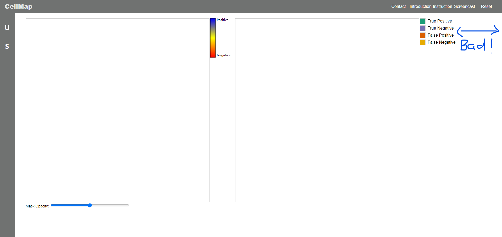
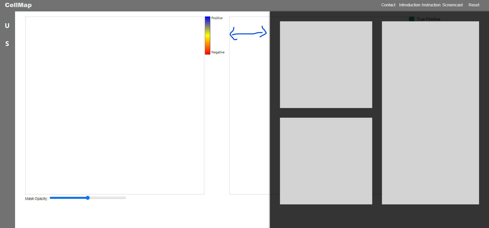
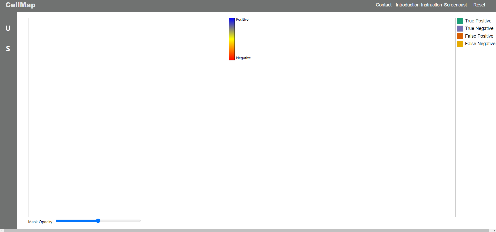
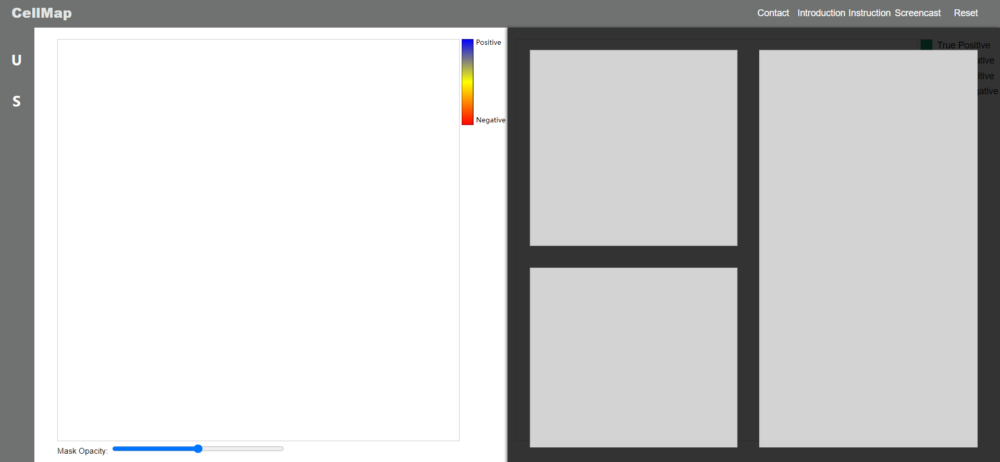

# CellMap

## Github Content

### 1. Code
The code, including HTML and JavaScript files, is located in the `docs` directory.

### 2. Documents
- **Proposal**: The project proposal can be found at the root level under the name `proposal.pdf`.  
- **Process Book**: The detailed process book is also available at the root level under the name `process_book.pdf`.

### 3. Other Contents
1. **Model**: Contains the weighted model used for predictions.  
2. **Python Scripts**: Includes Jupyter notebooks for exploratory analysis and preprocessing.  

---

## Links

1. **Data**: [https://drive.google.com/drive/folders/1NNUw7m1ukHwS0SsY46_UNLG_pR27JVm-?usp=drive_link](https://drive.google.com/drive/folders/1NNUw7m1ukHwS0SsY46_UNLG_pR27JVm-?usp=drive_link)
2. **Screencast**: [https://www.youtube.com/watch?v=m0KciIUgOQY](https://www.youtube.com/watch?v=m0KciIUgOQY)
3. **Project Website**: [https://dataviscourse2024.github.io/cellmap/](https://dataviscourse2024.github.io/cellmap/)

---

## Features

All features are explained with annotated images or detailed paragraphs in the process book, providing comprehensive insights into their design and implementation.

---

## Please adjust the zoom scale of your browser to make sure the color legend of the sub(right)-canvas is right next to the edge of the browser for a better experience. For example, this is not the best when:

## because the supportive panel won't fully cover the sub-canvas:

## It will be better if you can adjust the zoom scale:

## so:

## This is not critical to the project, but this could also be future work considering this app might be run on devices with different screen sizes.
